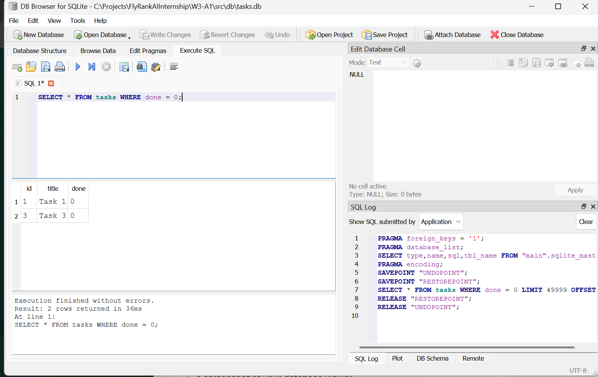

# W3-A1: SQLite Task Manager

## Why SQLite was chosen
SQLite was a strong fit for this project because it is lightweight, file-based, and requires no separate database server. That makes it simple to use for a small CRUD application like this one while keeping setup and maintenance easy.

## Database location
The SQLite database file is stored at src/db/tasks.db inside the W3-A1 folder. It is created automatically when the app starts for the first time.

## How to start the project
1. Install dependencies from the project root:
   npm install
2. Start the server:
   node W3-A1/server.js
3. Open the app in your browser at http://localhost:3000

## Database viewer screenshot
Here is a sample view of the database content in a SQLite viewer:



## Example SQL query
One example query I executed was:

```sql
SELECT id, title, done FROM tasks ORDER BY id;
```
